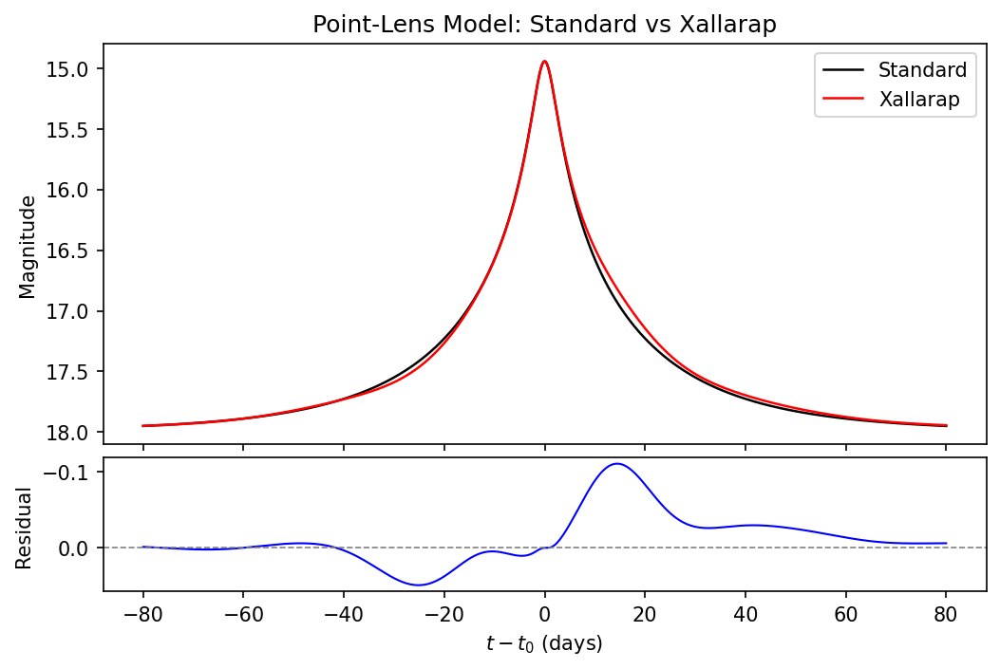

# xlrp

A Python package for modeling gravitational microlensing events with support for parallax and xallarap (source orbital motion) effects.

## Overview

xlrp fits point-lens microlensing models to multi-observatory photometric data. It supports ground-based observatories and space-based telescopes (now mainly Spitzer), with parameter estimation via MCMC (emcee) or nested sampling (dynesty).

## Features

- Point-lens microlensing magnification with linear limb-darkening
- Annual parallax (Earth orbital motion) and satellite parallax
- Xallarap modeling for source binary orbital motion (circular and eccentric orbits)
- Campbell and Thiele-Innes orbital parameterizations
- Binary-source xallarap with per-band flux ratios
- Multi-observatory data handling with error rescaling and bad-data masking
- MCMC and nested sampling for parameter estimation
- Light curve plotting utilities

## Dependencies

numpy, scipy, astropy, matplotlib, PyAstronomy, emcee, dynesty, PyYAML

## Quick Start

```python
import numpy as np
import matplotlib.pyplot as plt
from xlrp import PointLensModel

# Shared parameters
t_0, u_0, t_E = 2457199.5, 0.06, 37.0
ra, dec = "18:04:21.29", "-31:34:50.0"
t_0_par, t_ref = 2457200, 2457200

# Standard (point-lens) model
std_params = {"t_0": t_0, "u_0": u_0, "t_E": t_E}
model_std = PointLensModel(std_params, obname="ogle")

# Xallarap model (circular orbit, Campbell parameterization)
xlrp_params = {
    "t_0": t_0, "u_0": u_0, "t_E": t_E,
    "pi_E_N": 0.0, "pi_E_E": 0.0, "t_0_par": t_0_par,
    "xi_E_N": 0.03, "xi_E_E": -0.09,
    "i_xi": 1.56, "phi_xi": 1.6, "p_xi": 40.0, "t_ref": t_ref,
}
model_xlrp = PointLensModel(xlrp_params, ra=ra, dec=dec, obname="ogle")

# Generate time array and compute light curves
times = np.linspace(t_0 - 80, t_0 + 80, 500)
model_std.set_times(times)
model_xlrp.set_times(times)
mag_std = model_std.get_light_curve(fs=1.0, fb=0.0)
mag_xlrp = model_xlrp.get_light_curve(fs=1.0, fb=0.0)

# Plot comparison
fig, (ax1, ax2) = plt.subplots(2, 1, figsize=(8, 5), sharex=True,
                                gridspec_kw={"height_ratios": [3, 1], "hspace": 0.05})
t_plot = times - t_0
ax1.plot(t_plot, mag_std, "k-", label="Standard", lw=1.2)
ax1.plot(t_plot, mag_xlrp, "r-", label="Xallarap", lw=1.2)
ax1.set_ylabel("Magnitude")
ax1.invert_yaxis()
ax1.legend()
ax1.set_title("Point-Lens Model: Standard vs Xallarap")

ax2.plot(t_plot, mag_xlrp - mag_std, "b-", lw=1)
ax2.axhline(0, color="gray", ls="--", lw=0.8)
ax2.set_xlabel(r"$t - t_0$ (days)")
ax2.set_ylabel("Residual")
ax2.invert_yaxis()
plt.savefig("example_lightcurve.png", dpi=150, bbox_inches="tight")
```



## Project Structure

| Module | Description |
|--------|-------------|
| `model.py` | `PointLensModel` -- magnification, trajectories, parallax/xallarap |
| `data.py` | `Data` -- load photometry, mag/flux conversion, error rescaling |
| `event.py` | `Event` -- combine model + data, chi-squared evaluation |
| `utils/fitting.py` | MCMC/nested sampling likelihood functions and fitting utilities |
| `utils/param.py` | YAML parameter file I/O for all model types |
| `utils/config.py` | YAML event configuration handling |
| `utils/physics.py` | Physical parameter calculations (mass, velocity, orbital elements) |
| `utils/plot.py` | Light curve plotting |
| `ephemeris/` | Satellite ephemeris files (Spitzer, Kepler) |

## Acknowledgments

The structure of this package is inspired by [MulensModel](https://github.com/rpoleski/MulensModel).

## License and the related paper

MIT (Zhecheng Hu, 2023)

If you feel this project helps in your research, here is the paper to cite: [Hu et al. 2024](https://ui.adsabs.harvard.edu/abs/2024MNRAS.533.1991H/abstract):

```
@ARTICLE{2024MNRAS.533.1991H,
       author = {{Hu}, Zhecheng and {Zhu}, Wei and {Gould}, Andrew and {Udalski}, Andrzej and {Sumi}, Takahiro and {Chen}, Ping and {Calchi Novati}, Sebastiano and {Yee}, Jennifer C. and {Beichman}, Charles A. and {Bryden}, Geoffery and {Carey}, Sean and {Fausnaugh}, Michael and {Gaudi}, B. Scott and {Henderson}, Calen B. and {Shvartzvald}, Yossi and {Wibking}, Benjamin and {Mr{\'o}z}, Przemek and {Skowron}, Jan and {Poleski}, Rados{\l}aw and {Szyma{\'n}ski}, Micha{\l} K. and {Soszy{\'n}ski}, Igor and {Pietrukowicz}, Pawe{\l} and {Koz{\l}owski}, Szymon and {Ulaczyk}, Krzysztof and {Rybicki}, Krzysztof A. and {Iwanek}, Patryk and {Wrona}, Marcin and {Gromadzki}, Mariusz and {Abe}, Fumio and {Barry}, Richard and {Bennett}, David P. and {Bhattacharya}, Aparna and {Bond}, Ian A. and {Fujii}, Hirosane and {Fukui}, Akihiko and {Hamada}, Ryusei and {Hirao}, Yuki and {Silva}, Stela Ishitani and {Itow}, Yoshitaka and {Kirikawa}, Rintaro and {Koshimoto}, Naoki and {Matsubara}, Yutaka and {Miyazaki}, Shota and {Muraki}, Yasushi and {Olmschenk}, Greg and {Ranc}, Cl{\'e}ment and {Rattenbury}, Nicholas J. and {Satoh}, Yuki and {Suzuki}, Daisuke and {Tomoyoshi}, Mio and {Tristram}, Paul J. and {Vandorou}, Aikaterini and {Yama}, Hibiki and {Yamashita}, Kansuke},
        title = "{OGLE-2015-BLG-0845L: a low-mass M dwarf from the microlensing parallax and xallarap effects}",
      journal = {\mnras},
     keywords = {Astrophysics - Solar and Stellar Astrophysics, Astrophysics - Earth and Planetary Astrophysics, Astrophysics - Astrophysics of Galaxies},
         year = 2024,
        month = sep,
       volume = {533},
       number = {2},
        pages = {1991-2004},
          doi = {10.1093/mnras/stae1906},
archivePrefix = {arXiv},
       eprint = {2404.13031},
 primaryClass = {astro-ph.SR},
       adsurl = {https://ui.adsabs.harvard.edu/abs/2024MNRAS.533.1991H},
      adsnote = {Provided by the SAO/NASA Astrophysics Data System}
}
```
